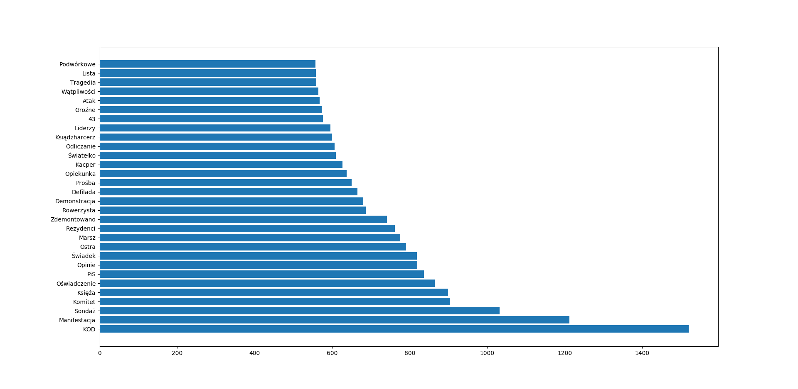

# Articles
Articles for data science learning.

## Scraped sites:
- [interia](www.interia.pl)
- [obserwator gospodarczy](http://www.obserwatorgospodarczy.pl/)
- [superexpress](https://www.se.pl/)
- [wyborcza](http://wyborcza.pl/0,0.html)
- [trojmiasto.pl](https://www.trojmiasto.pl/)

## What's done:
### Based on trojmiasto.pl
* length of the headline and amount of opinions

* category and amount of opinions

* last word in the headline and amount of opinions

* first word in the headline and amount of opinions

### Based on all data
* Most popular categories

* Average length of headline in category
